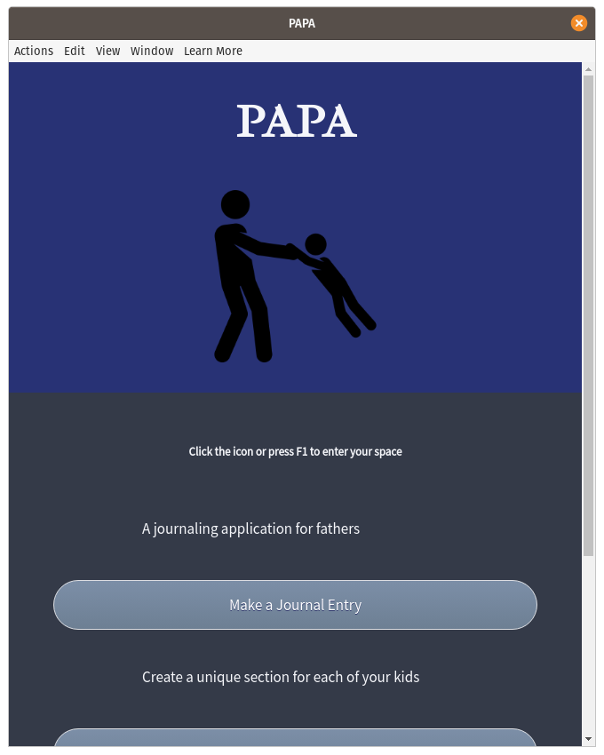

# PAPA

## An Electron Journaling App for Fathers 

### This is a reflection and organizational tool intended to make life richer for Dads everywhere. A place to keep memories, thoughts, goals, and dreams. 

*While it can be used as an information hub for interests and activities* - **most of all it is a place for thoughts and reflections**. 

* Make note of their your children's changing interests.
* Insert photographs to document their growth.
* Document any health concerns.
* Multiple journaling spaces for thoughts and reflections.
* Easily save your profile or your childrens' profiles onto your local computer at any time.
* Create separate books for each of your kids.

### MY ELEVATOR PITCH

This is a desktop application for journaling - built for fathers. It is a place to record thoughts and memories. It will be an electronic scrapbook - local to each users computer - cross platform. The user can add images or files - jot down ideas, plans and goals. 

### USER STORIES

This app is for dads who spend a lot of time at their computer and would like to have a place where they can add information about their children as they are growing. It is for people who like to reflect. I am targeting users who wish they could download all their children related entries from Facebook over the years and have it all on their own computer. It is for fathers who place their parenting as the top priority in their life - and use the app as a tool to get better at their job. Also, for those that would like a way to keep "talking" to their kids - even if something happens to them and they can not be there for them.

### ARCHITECTURE

* Electron JS framework
* Node.js
* HTML
* CSS
* JavaScript

### MVP

* An Electron app that can input and display journal entries

* A clean, simple and intuitive UI

#### Sources I am using to get up to speed on the tech:

[Udemy Master Electron: Desktop Apps with HTML, JavaScript and CSS](https://www.udemy.com/course/master-electron/)

[Electron Tutorial App Github Repository](https://github.com/crilleengvall/electron-tutorial-app)

[Why you should know about Electron.js in 2019](https://dev.to/borrellidev/why-you-should-know-about-electron-js-in-2019-1f4m)

[Electron Basics - Desktop Apps w/ JavaScript](https://www.youtube.com/watch?v=nW4Qe4QBWow)

[Creating a text editor in Electron: part 1 - Reading files](https://dev.to/aurelkurtula/creating-a-text-editor-in-electron-reading-files-13b8)

[Learn Electron in Less than 60 Minutes - Free Beginner's Course](https://www.youtube.com/watch?v=2RxHQoiDctI)

[Awesome Electron on GitHub](https://github.com/sindresorhus/awesome-electron)

### Resources to Build the App

[Electronjs Documentation](https://www.electronjs.org/docs)

[React.js](https://reactjs.org/)

[Flat UI Colors](https://flatuicolors.com/)

[Flaticon](https://www.flaticon.com/)

## STRETCH GOALS
* Figure out a way to let the user write/preview - in markdown.

* The ability to write and save dated journal entries locally to their computer and access those within the application every time it is launched.

* The ability to save image files or other files like pdf or text files - within the app.

* The user can download this app from the GitHub repository and install on their computer, whether the user is running MacOS, Linux or Windows.

* A major feature will be a section called *I WANT YOU TO KNOW* within the app where users can share words with their children in the case of their death or absence of any kind, by setting a "code word" for each child. 

    * That child can then use that password to unlock the messages from the user. There should be a trusted partner - *also with a password** - who can unlock the "code words".

